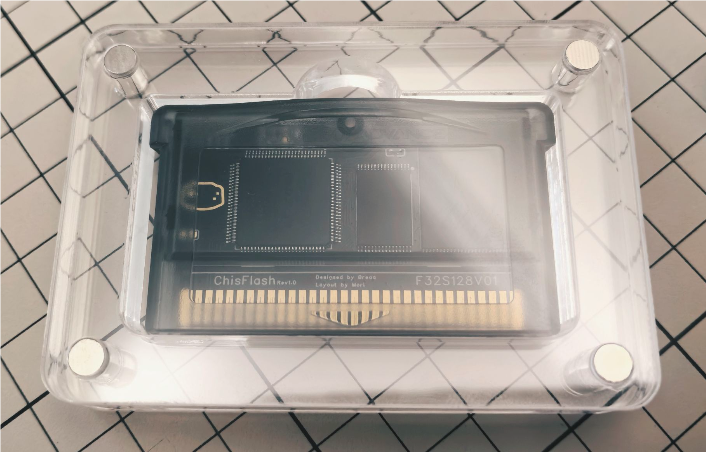
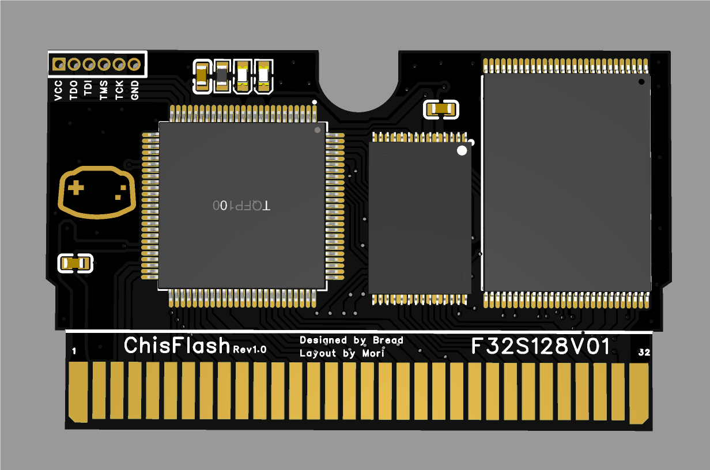
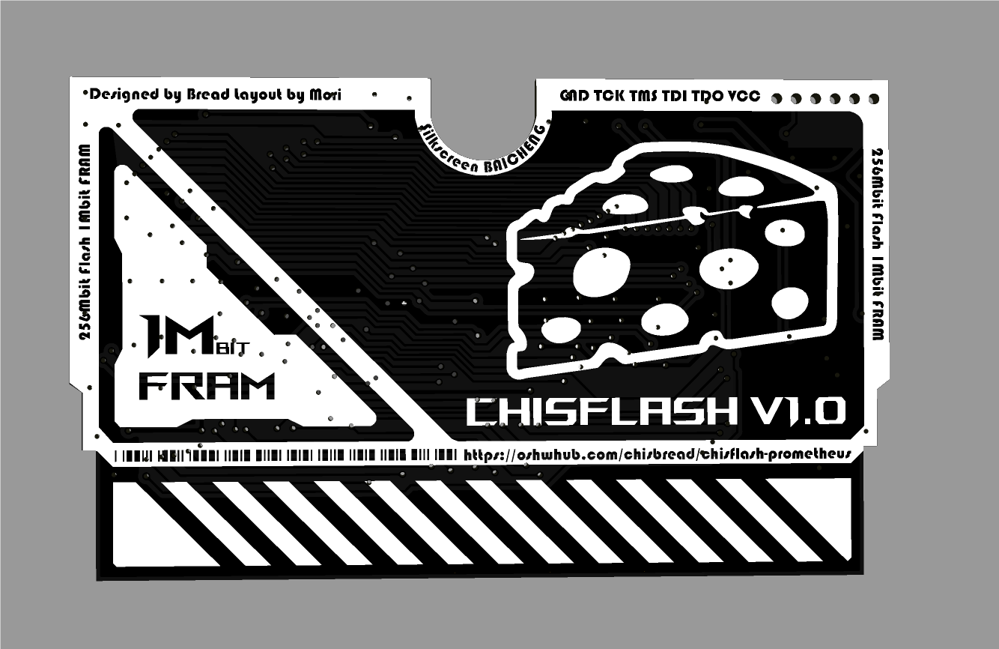
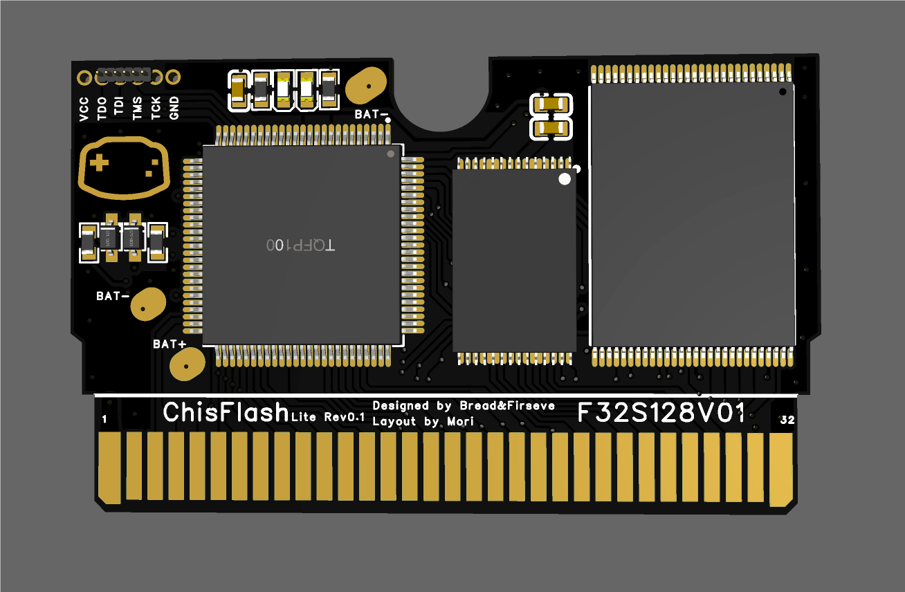
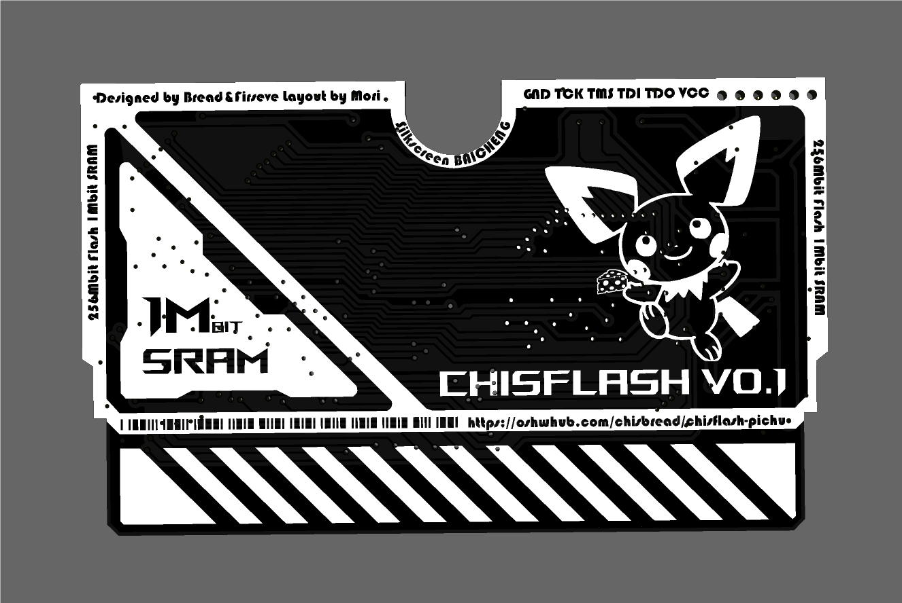
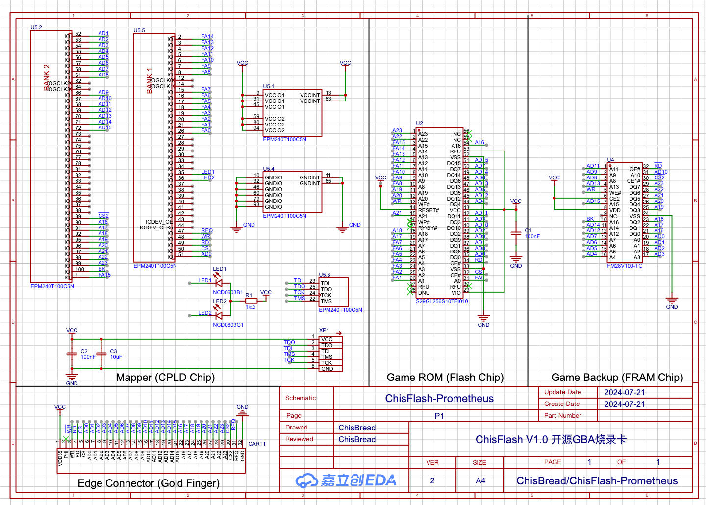

# ChisFlash
- ChisFlash is an open source GBA flashcart, which is inspired by the [opencartgba](https://github.com/laqieer/opencartgba) project.
- oshwhub: [ChisBread](https://oshwhub.com/chisbread/works)
- v1.0(Prometheus) version uses FRAM, v0.1 version uses SRAM (1Mbit).

# Features

- The development goal of ChisFlash is to implement a fully functional GBA flashcart.

| Feature | Status |
| --- | --- |
| 256Mbit Flash | ✅ |
| 512Kbit SRAM/FRAM | ✅ |
| 1Mbit SRAM/FRAM (Bank Switching) | ✅ |
| Real-Time Clock (RTC) | x |
| Rumble | x |
| Gyro | x |
| Solar Sensor | x |

# Images






# Schematic



# BOM

- [ChisFlash BOM](BOM.md)

# Directory Structure   

```
ChisFlash
├── README.md
├── LICENSE
├── hardware
├── firmware
│   └── QuartusII1MSRAM
├── document-zh
```

#### p.s.

- ChisFlash/hardware PCB design files
- ChisFlash/firmware/QuartusII1MSRAM is a CPLD/FPGA project for memory mapping (for 1M SRAM/FRAM)
- ChisFlash/document is a Chinese document for ChisFlash