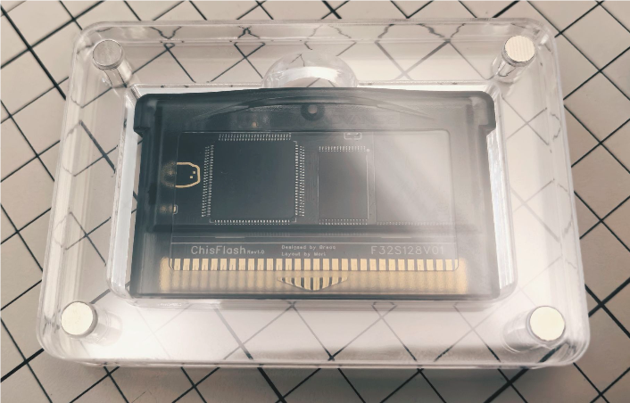
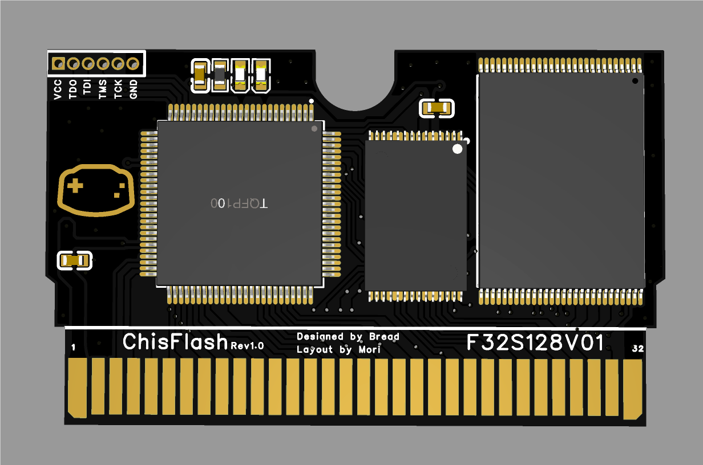

# ChisFlash

- [English](README-en.md)

- ChisFlash是开源GBA烧录卡，它的灵感来自[opencartgba](https://github.com/laqieer/opencartgba)项目。
- 立创开源项目地址：[ChisBread](https://oshwhub.com/chisbread/works)
- v1.0(Prometheus)版本适用FRAM，v0.1版本适用SRAM (1Mbit)。

# 功能特性

- ChisFlash的开发目标是实现一个功能齐全的GBA烧录卡

| 特性 | 状态 |
| --- | --- |
| 256Mbit闪存 | ✅ |
| 512Kbit SRAM/FRAM | ✅ |
| 1Mbit SRAM/FRAM（Bank Switching） | ✅ |
| 实时时钟（RTC） | × |
| 振动反馈 | × |
| 陀螺仪 | x |
| 太阳传感器 | × |

# 效果图





# 原理图


# BOM

- [ChisFlash BOM](BOM.md)

# 目录结构   

```
ChisFlash
├── README.md
├── LICENSE
├── hardware
├── firmware
│   └── QuartusII1MSRAM
├── document-zh
```

#### 补充说明

- ChisFlash/hardware PCB设计文件
- ChisFlash/firmware/QuartusII1MSRAM 固件目录 (适配1M SRAM/FRAM)
- ChisFlash/document是ChisFlash的中文技术文档